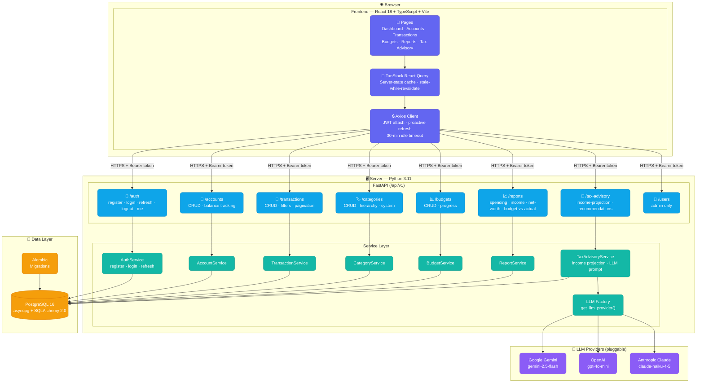
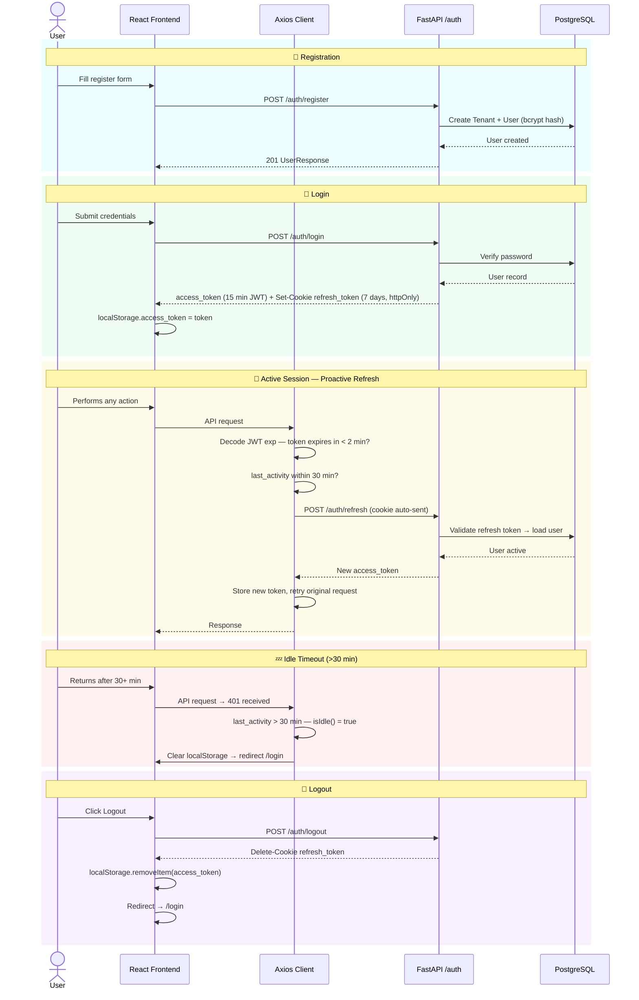
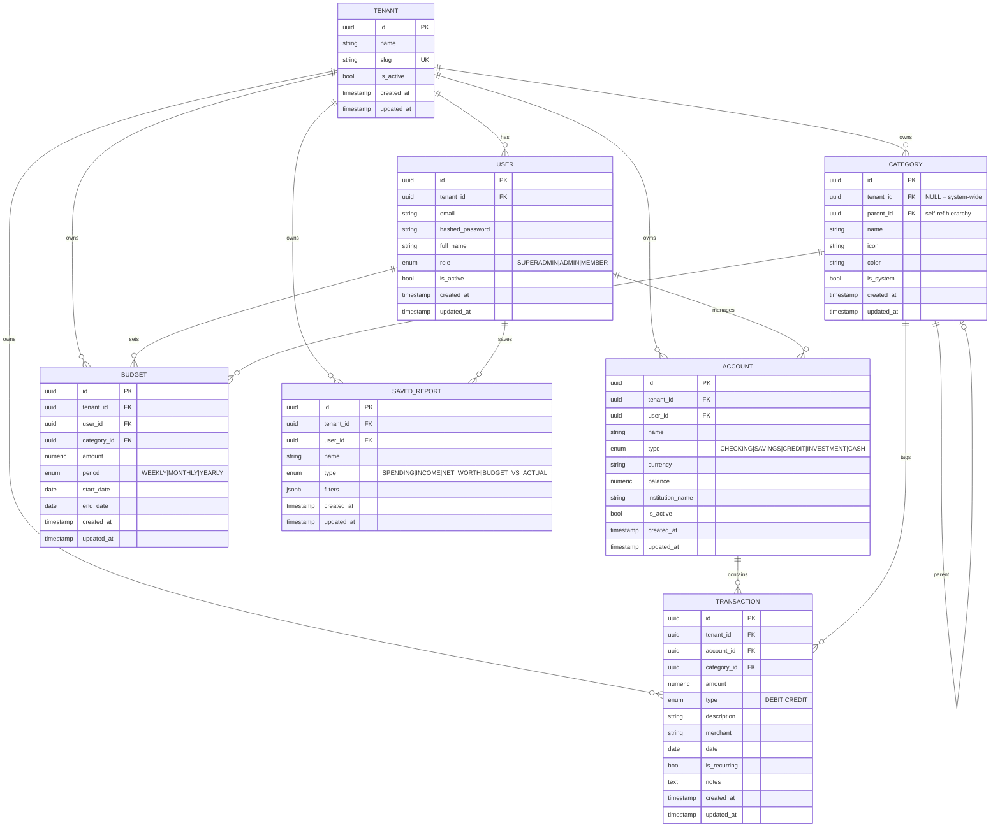
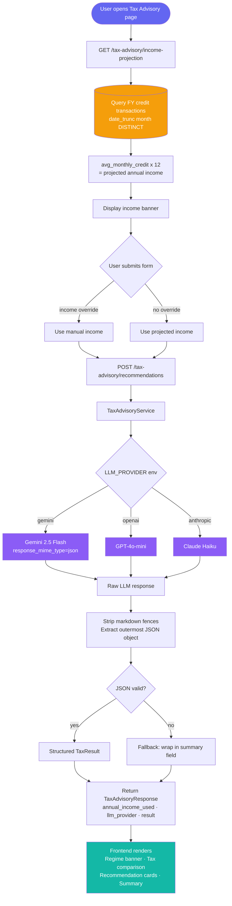
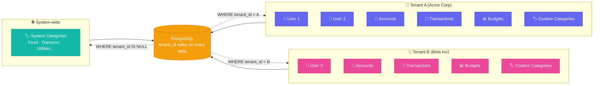

# Architecture Diagrams

## 1. System Overview

---

## 2. Authentication & Session Flow

---

## 3. Database Entity Relationship Diagram

---

## 4. AI Tax Advisory Flow

---

## 5. Multi-Tenancy Data Isolation

